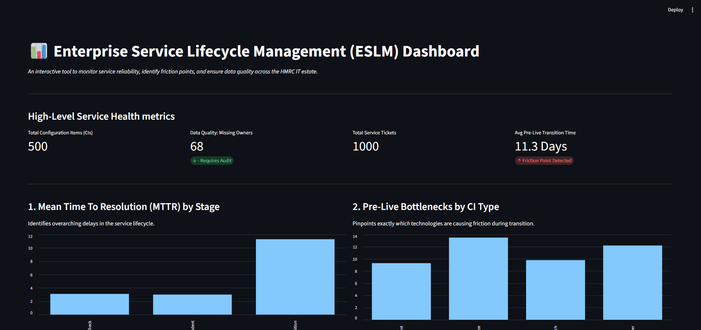

# ESLM Friction Analyser 📊


## 📖 Project Overview

This project is a **"Service-First" Data Pipeline and Visualisation Tool** designed to optimise Enterprise Service Lifecycle Management (ESLM). 

Built specifically to align with the operational goals of an enterprise IT environment, this tool treats **"data as the bedrock"** of IT Service Management. It automatically audits simulated Configuration Items (CIs) for data quality issues and analyses service tickets to identify friction points—specifically tracking Mean Time to Resolution (MTTR) when transitioning systems from **Pre-Live to Live** environments.

---

## 🖥️ Dashboard Preview




---

## 🚀 Key Insights Discovered

* **Data Quality Assurance:** Automatically identified Configuration Items missing critical ownership data, flagging them as `UNASSIGNED_REQUIRES_AUDIT` to mitigate compliance risks.
* **Systemic Friction Points:** Discovered that 'Pre-Live Transitions' take an average of **11.3 days**, significantly longer than Live Incidents (3.0 days).
* **Technological Bottlenecks:** Proved through relational data analysis that **Databases (13.5 days avg)** are the primary bottleneck slowing down the deployment pipeline.

---

## 📂 Repository Structure

```text
eslm-friction-analyser/
├── data/                      # (Git-ignored: Generated locally via script)
│   ├── raw/                   # Raw simulated datasets
│   └── processed/             # Cleaned datasets and insight reports
├── src/                       
│   ├── ingestion.py           # Pipeline Step 1: CI integrity and data quality control
│   └── analysis.py            # Pipeline Step 2: MTTR and bottleneck identification
├── app/                       
│   └── dashboard.py           # Pipeline Step 3: Streamlit visualisation dashboard
├── generate_mock_data.py      # Run this first to build the "data bedrock"
├── requirements.txt           # Python dependencies
└── README.md
## Setup & Installation
### 1. Clone the Repository:
```bash
git clone https://github.com/mistryhh/Eslm-Friction-Analyser
cd Eslm-Friction-Analyser
```
### 2. Install Required Dependancies:
```bash
pip install -r requirements.txt
```
## Running the Pipeline
### 1. Generate the Simulated Enterprise Data
```bash
python generate_mock_data.py
```
### 2. Run the Data Pipeline
```bash
python src/ingestion.py
python src/analysis.py
```
### 3. Launch the Insights Dashboard
```bash
streamlit run app/dashboard.py
```

